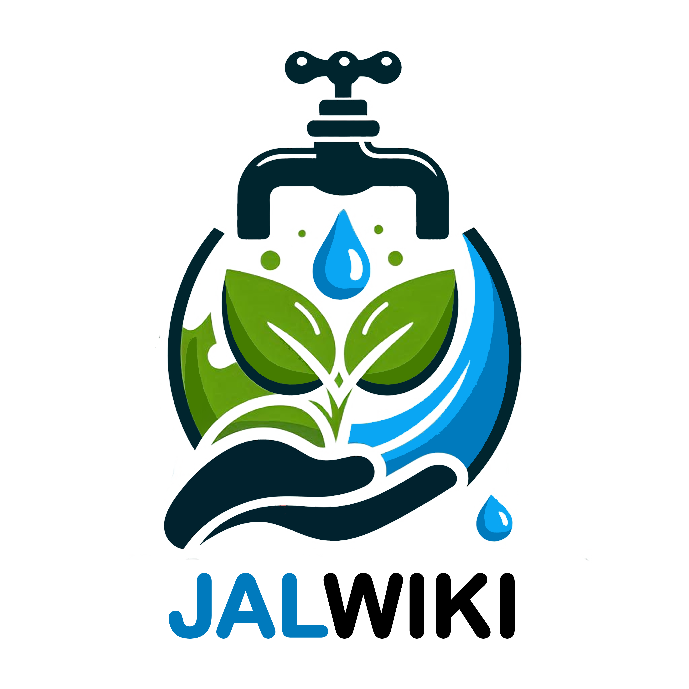

<h2 align="center">🌊 JalWiKi: Digital Platform for Water Conservation</h2>

<h3 align="center">Empowering Knowledge Sharing and Collaboration for Sustainable Water Management</h3>

<b>JalWiKi</b> is a comprehensive digital platform designed to combat water scarcity through collaborative knowledge sharing. Built with modern web technologies, it serves as a centralized hub where water conservation experts, enthusiasts, and learners can contribute, discover, and implement sustainable water management solutions with detailed guides, benefits, materials, and step-by-step instructions
 

 
  
  
  
  
  
  
  
  
  
  
  
  

### Table of Contents
- [Key Features](#key-features)
- [Technology Stack](#technology-stack)
- [Prerequisites](#-prerequisites)
- [Installation](#installation)
- [API Documentation](#api-documentation)
- [Screenshots](#screenshots)
- [Contributing](#-contributing)
- [Support & Contact](#-support--contact)

---
### Key Features

- **📚 Collaborative Knowledge Platform**: Wikipedia-style editing with secure authentication and responsive design
- **💧 Comprehensive Technique Database**: Searchable conservation methods with regional mapping and visual guides
- **🤝 Community Engagement**: Discussion forums with voting, user tracking, and flexible tagging system
- **🤖 AI-Powered Intelligence**: Smart recommendations and problem-solving using Google Gemini AI
- **🏛️ Government Integration**: Access to water schemes, policy updates, and NGO partnerships

### Technology Stack

#### **Backend Technologies**
-  **Python 3.11** - Core backend language
-  **Django 5.1.6** - Web framework
-  **Django REST Framework** - API development
-  **PostgreSQL** - Primary database
-  **JWT Authentication** - Secure token-based auth

#### **Frontend Technologies**
-  **Next.js 15.2.4** - React framework
-  **React 19.1.0** - UI library
-  **TypeScript 5.0** - Type-safe JavaScript
-  **Tailwind CSS** - Utility-first CSS framework
-  **Radix UI** - Accessible component primitives

#### **Additional Tools & Libraries**
-  **Firebase** - Additional services integration
-  **Axios** - HTTP client
-  **Framer Motion** - Animation library
- **Google Gemini AI** - AI-powered features

---

### Quick Start Guide

### 📋 Prerequisites

Before you begin, ensure you have the following installed:

-  **Python 3.11 or higher**
-  **Node.js 18.x or higher**
-  **PostgreSQL 12 or higher**
-  **Git** (for version control)

### Installation
- [Here](Installation.md)

### API Documentation
- [Here](API_DOCUMENTATION.md)

### Screenshots
- [Here](SCREENSHOTS.md)

----

### 🤝 Contributing

Contributions are what make the open-source community such an amazing place to learn, inspire, and create. Any contributions you make are **greatly appreciated**.

If you have a suggestion that would make this better, please fork the repo and create a pull request. You can also simply open an issue with the tag "enhancement".

### 📞 Support & Contact

For questions, support, or collaboration opportunities:

- **📧 Email**: [itsaitsavipatil@gmail.com](mailto:itsaitsavipatil@gmail.com)
- **🐛 Issues**: [GitHub Issues](https://github.com/yourusername/JalWiKi/issues)
- **💬 Discussions**: [GitHub Discussions](https://github.com/yourusername/JalWiKi/discussions)

### 📄 License

This project is licensed under the **MIT License** - see the [LICENSE](LICENSE) file for details.

----

  
  ### 🌊 *"Every drop counts in the journey towards water sustainability"* 🌊
  
  **Made with ❤️ by [Avishkar Patil](mailto:itsaitsavipatil@gmail.com)**
  
  **© 2025 JalWiKi Project. All rights reserved.**
  

