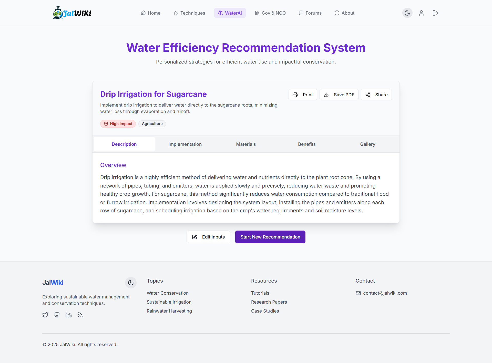
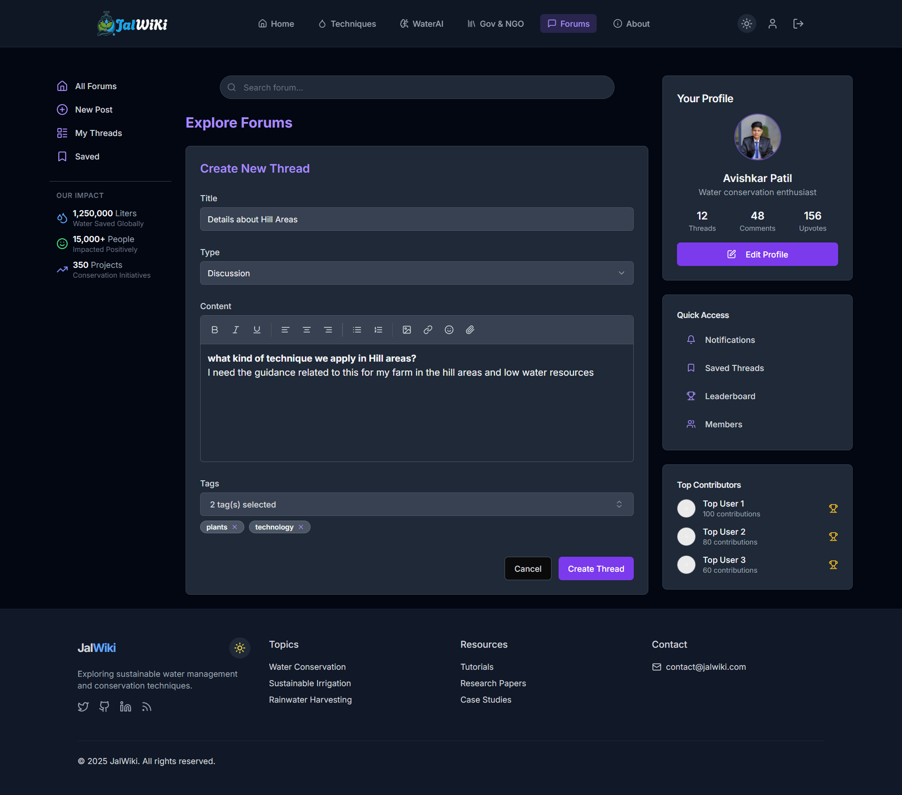

  
  # 📸 JalWiKi Platform Screenshots
  
  ### *Visual Tour of the Water Conservation Platform*
  
  
  
  
  

---

## 🌟 Platform Overview

Explore JalWiKi's comprehensive water conservation platform through these detailed screenshots showcasing both **Light** and **Dark** themes across all major features and functionalities.

## 📋 Table of Contents

- [🏠 Home Page](#-home-page)
- [🔐 Authentication System](#-authentication-system)
- [💧 Water Conservation Techniques](#-water-conservation-techniques)
- [🤖 AI-Powered Water Solutions](#-ai-powered-water-solutions)
- [💬 Community Forums](#-community-forums)
- [🏛️ Government & NGO Integration](#️-government--ngo-integration)
- [👤 User Profile & Dashboard](#-user-profile--dashboard)
- [ℹ️ About Page](#ℹ️-about-page)
- [📄 PDF Export Feature](#-pdf-export-feature)

---

## 🏠 **Home Page**

<table align="center">
<tr>
<td align="center">
<h4>🏠 Home Page</h4>

 <i>Light Theme</i>
</td>
<td align="center">
<h4>🏠 Home Page</h4>

 <i>Dark Theme</i>
</td>
</tr>
</table>

*The homepage features a dynamic hero carousel, comprehensive services grid, user testimonials, and call-to-action sections optimized for both themes.*

---

## 🔐 **Authentication System**

<table align="center">
<tr>
<td align="center">
<h4>🔐 Login Page</h4>

 <i>Light Theme</i>
</td>
<td align="center">
<h4>📝 Registration Page</h4>

 <i>Light Theme</i>
</td>
</tr>
<tr>
<td align="center">

 <i>Dark Theme</i>
</td>
<td align="center">

 <i>Dark Theme</i>
</td>
</tr>
</table>

*Secure authentication system with JWT token management, form validation, and seamless theme integration.*

---

## 💧 **Water Conservation Techniques**

### **Techniques Overview**

<table align="center">
<tr>
<td align="center">
<h4>📋 List View</h4>

 <i>Light Theme</i>
</td>
<td align="center">
<h4>🔲 Grid View</h4>

 <i>Light Theme</i>
</td>
</tr>
<tr>
<td align="center">

 <i>Dark Theme</i>
</td>
<td align="center">

 <i>Dark Theme</i>
</td>
</tr>
</table>

### **Technique Details**

<table align="center">
<tr>
<td align="center">
<h4>📄 Technique Details</h4>

 <i>Light Theme</i>
</td>
<td align="center">
<h4>📄 Technique Details</h4>

 <i>Dark Theme</i>
</td>
</tr>
</table>

*Comprehensive technique details including benefits, required materials, step-by-step implementation guides, and regional applicability.*

### **Add New Technique**

<table align="center">
<tr>
<td align="center">
<h4>📝 Form Step 1</h4>

 <i>Light Theme</i>
</td>
<td align="center">
<h4>📝 Form Step 2</h4>

 <i>Light Theme</i>
</td>
</tr>
<tr>
<td align="center">

 <i>Dark Theme</i>
</td>
<td align="center">

 <i>Dark Theme</i>
</td>
</tr>
</table>

*Multi-step technique creation process with comprehensive form validation and rich text editing capabilities.*

---

## 🤖 **AI-Powered Water Solutions**

### **AI Form Interface**

<table align="center">
<tr>
<td align="center">
<h4>🤖 AI Input Form</h4>

 <i>Light Theme</i>
</td>
<td align="center">
<h4>🤖 AI Input Form</h4>

 <i>Dark Theme</i>
</td>
</tr>
<tr>
<td align="center">
<h4>📝 Form with Input</h4>

 <i>Light Theme</i>
</td>
<td align="center">
<h4>📝 Form with Input</h4>

 <i>Dark Theme</i>
</td>
</tr>
</table>

### **AI Processing & Results**

<table align="center">
<tr>
<td align="center">
<h4>🔄 Processing State</h4>

 <i>Light Theme</i>
</td>
<td align="center">
<h4>🔄 Processing State</h4>

 <i>Dark Theme</i>
</td>
</tr>
<tr>
<td align="center">
<h4>✨ AI Results</h4>

 <i>Light Theme</i>
</td>
<td align="center">
<h4>✨ AI Results</h4>

 <i>Dark Theme</i>
</td>
</tr>
</table>

*Advanced AI integration powered by Google Gemini providing personalized water conservation recommendations and solutions.*

---

## 💬 **Community Forums**

### **Forum Overview**

<table align="center">
<tr>
<td align="center">
<h4>💬 Forum Page</h4>

 <i>Light Theme</i>
</td>
<td align="center">
<h4>💬 Forum Page</h4>

 <i>Dark Theme</i>
</td>
</tr>
</table>

### **Thread Management**

<table align="center">
<tr>
<td align="center">
<h4>📝 Create Thread</h4>

 <i>Light Theme</i>
</td>
<td align="center">
<h4>👁️ View Thread</h4>

 <i>Light Theme</i>
</td>
</tr>
<tr>
<td align="center">

 <i>Dark Theme</i>
</td>
<td align="center">

 <i>Dark Theme</i>
</td>
</tr>
</table>

*Comprehensive forum system with threaded discussions, voting mechanisms, tagging, and real-time interactions.*

---

## 🏛️ **Government & NGO Integration**

<table align="center">
<tr>
<td align="center">
<h4>🏛️ Government & NGO</h4>

 <i>Light Theme</i>
</td>
<td align="center">
<h4>🏛️ Government & NGO</h4>

 <i>Dark Theme</i>
</td>
</tr>
</table>

*Integration with government water conservation schemes, policy updates, and NGO partnership information.*

---

## 👤 **User Profile & Dashboard**

<table align="center">
<tr>
<td align="center">
<h4>👤 User Profile</h4>

 <i>Light Theme</i>
</td>
<td align="center">
<h4>👤 User Profile</h4>

 <i>Dark Theme</i>
</td>
</tr>
</table>

*Personalized user profiles showcasing contributions, saved techniques, forum activity, and achievement tracking.*

---

## ℹ️ **About Page**

<table align="center">
<tr>
<td align="center">
<h4>ℹ️ About Page</h4>

 <i>Light Theme</i>
</td>
<td align="center">
<h4>ℹ️ About Page</h4>

 <i>Dark Theme</i>
</td>
</tr>
</table>

*Comprehensive platform information including mission, vision, impact metrics, and team details.*

---

## 📄 **PDF Export Feature**

*Advanced PDF export functionality allowing users to save and share water conservation techniques offline.*

---

## 🎨 **Design Highlights**

### **🌓 Dual Theme Support**
- **Light Mode**: Clean, professional interface optimized for daylight viewing
- **Dark Mode**: Modern, eye-friendly design perfect for extended usage

### **📱 Responsive Design**
- Mobile-first approach ensuring seamless experience across all devices
- Adaptive layouts that maintain functionality on any screen size

### **🎯 User Experience**
- Intuitive navigation with clear visual hierarchy
- Consistent design language across all platform sections
- Accessibility-focused interface design

### **⚡ Performance Optimized**
- Fast loading times with optimized image delivery
- Smooth transitions and animations
- Efficient state management for real-time updates

---

## 🔧 **Technical Features Showcased**

- **🔐 JWT Authentication** - Secure login/registration system
- **🤖 AI Integration** - Google Gemini-powered recommendations
- **💬 Real-time Forums** - Community discussions with threading
- **📊 Advanced Search** - Filtering and categorization
- **🎨 Theme Switching** - Dynamic light/dark mode toggle
- **📱 Responsive UI** - Mobile-optimized interface
- **📄 PDF Export** - Offline content sharing capability
- **🏛️ Government Integration** - Policy and scheme information

---

  
  ### 🌊 *Experience JalWiKi - Where Technology Meets Water Conservation* 🌊
  
  **Ready to explore the platform? [Get Started](README.md#-quick-start-guide)**
  
  ---
  
  **© 2025 JalWiKi Project. All rights reserved.**
  
  *Made with ❤️ by [Avishkar Patil](mailto:itsaitsavipatil@gmail.com)*
  

